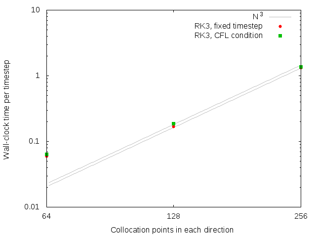

# Adding in the CFL condition

The CFL condition doesn't increase runtime per step much (though of course it will increase runtime per simulation time unit).
Grey lines should the expected increase (11.1%, due to 3 new DFTs, compared to the 27 DFTs already required in RK3).
We're acutally seeing a smaller fractional increase than this, so good.

