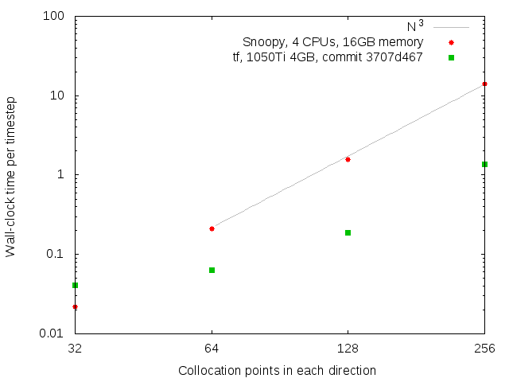

# Tensorflow code versus snoopy

I did some runs using the tensorflow-based code on my desktop with the 1050Ti GPU, and some runs of snoopy using MPI with 4 processors on my laptop.
At N=256 we get a speed-up by a factor of 10.2 for the GPU-accelerated code.

